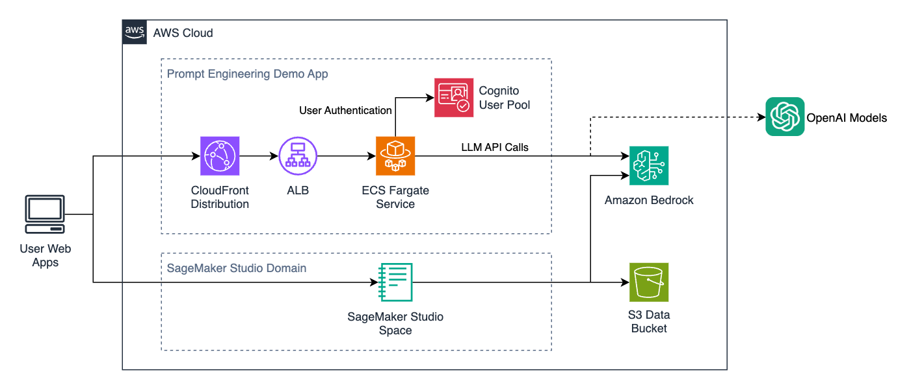

# LLM Evaluation demo app and workshop infrastructure

This project includes a containerized prompt engineering / evaluation demo app, infrastructure-as-code to deploy it, and additional code to deploy an [Amazon SageMaker Studio Domain](https://docs.aws.amazon.com/sagemaker/latest/dg/sm-domain.html) pre-configured ready to use in a guided workshop setting (in case you don't have one already).


## Architecture overview

The demo app is built in Python with [Streamlit](https://streamlit.io/) (see the [prompt_app folder](prompt_app)) and deployed as an [ECS Fargate](https://docs.aws.amazon.com/AmazonECS/latest/developerguide/AWS_Fargate.html) serverless container, behind an [Application Load Balancer](https://docs.aws.amazon.com/elasticloadbalancing/latest/application/introduction.html) (via the [`ApplicationLoadBalancedFargateService` CDK construct](https://docs.aws.amazon.com/cdk/api/v2/docs/aws-cdk-lib.aws_ecs_patterns.ApplicationLoadBalancedFargateService.html)). Users connect over HTTPS through [Amazon CloudFront](https://aws.amazon.com/cloudfront/), and log in with authentication provided by an [Amazon Cognito User Pool](https://docs.aws.amazon.com/cognito/latest/developerguide/cognito-user-identity-pools.html).



The above infrastructure, and the optional SageMaker Studio Domain deployment, is implemented in and deployed through [AWS CDK for Python](https://aws.amazon.com/cdk/). Since deploying CDK code requires setting up a development environment (as detailed below), we also provide a directly-deployable ["bootstrap" CloudFormation template](cfn_bootstrap.yaml) which fetches this repository and runs the CDK deploment via [AWS CodeBuild](https://aws.amazon.com/codebuild/).

> ⚠️ **Note:** The above CloudFormation template creates an AWS CodeBuild Project with broad IAM permissions to deploy the solution on your behalf. It's not recommended for use in production-environments where [least-privilege principles](https://aws.amazon.com/blogs/security/techniques-for-writing-least-privilege-iam-policies/) should be followed.


## Important caveats

The data-driven prompt engineering app is provided as a basic example of how automated evaluation can improve prompt engineering workflows, but is not recommended for production use as-is. Important considerations for extending the app into a production solution would include:

1. Although each user's session state is not shared with others, the application does not implement full multi-user management with configurable permissions and sharing. Local temporary files are used for manipulating uploaded datasets on the containerized service, and may cause unexpected behaviour or resource exhaustion with multiple concurrent users.
2. We provide a Python ["data model"](prompt_app/src/datamodel) that attempts to describe sensible abstractions for configuration management of e.g. models, inference parameters, prompt templates, etc... But haven't yet implemented persistent storage for these objects. A fully-featured solution could consider NoSQL storage options like Amazon DynamoDB.
3. Although Streamlit is useful for quick UI prototyping with teams familiar with Python, it's not a fully-featured web UI development framework. Before investing in building more advanced UI features and workflow improvements, consider whether your long-term requirements would merit switching to something else.

For a detailed list of other security configurations you might want to optimize before using the stack in prodution, you can enable [cdk-nag](https://github.com/cdklabs/cdk-nag) by running the build with the `CDK_NAG=true` environment variable or editing the defaults in [cdk_app.py](cdk_app.py). You don't need to request stack deployment to complete this analysis: running `npx cdk synth` would show the same error list.


## Development environment pre-requisites

To customize and deploy from source code, you'll need:

- [NodeJS](https://nodejs.org/en) installed
    - The minimum required version is specified in [package.json](package.json) `engines` field and the canonical development version is specified in [.nvmrc](.nvmrc)
    - If you work across multiple projects and need to manage multiple parallel versions of NodeJS on your system, you may want to install it via [NVM](https://github.com/nvm-sh/nvm) or [NVM-Windows](https://github.com/coreybutler/nvm-windows)
- [Python](https://www.python.org/)
    - The minimum required version is specified in [pyproject.toml](pyproject.toml) and the canonical development version is specified in [.python-version](.python-version)
    - If you work across multiple projects and need to manage multiple parallel versions of Python on your system, you may want to install it via [pyenv](https://github.com/pyenv/pyenv) or [pyenv for Windows](https://github.com/pyenv-win/pyenv-win)
- The [AWS CLI](https://aws.amazon.com/cli/) installed and [configured / logged in](https://docs.aws.amazon.com/cli/latest/userguide/cli-configure-files.html) with access to your AWS Account
- [Docker Desktop](https://www.docker.com/products/docker-desktop/) (or a suitable alternative) installed for building (and maybe locally testing?) container images.


### (Optional) To use OpenAI models

In addition to Amazon Bedrock and Amazon SageMaker, the app includes a connector for running evaluations on OpenAI-based models.

To use this, you'll need to [create a plain text secret in AWS Secrets Manager](https://docs.aws.amazon.com/secretsmanager/latest/userguide/create_secret.html) called `openai_key`, containing your OpenAI API key. The prompt engineering app will securely read the key from this store when required.

If you'd like to use a secret with a different name, locate the mentions of `openai_key` in this codebase where we:
- Configure the secret name in the `prompt_app`, and
- Grant the ECS service permission to read this secret value in the `cdk_src`.


## Getting started

The following commands assume you're working in a terminal from the same directory as this README.

These examples use `$` to indicate the prompt of a Bash/POSIX-like shell (e.g. on macOS or Linux), and `%` to indicate a Windows-like shell. You only need to type the commands **after** the prompt!

### Install & activate

If you haven't already, consider setting your `AWS_REGION` and `AWS_DEFAULT_REGION` environment variables to your target AWS Region for deployment:

```sh
$ export AWS_REGION="us-west-2"
$ export AWS_DEFAULT_REGION="us-west-2"
```

**IF** you're using NVM and/or pyenv, first activate the target versions of NodeJS and/or Python:

```sh
$ nvm use  # Should discover version from .nvmrc file
$ pyenv local  # Should discover version from .python-version file
```

Install the [CDK Toolkit CLI](https://docs.aws.amazon.com/cdk/v2/guide/cli.html) and any other NodeJS dependencies from [package.json](package.json) **locally** in the project:

```sh
$ npm install  # Will enable locally-versioned `npx cdk deploy` rather than global `cdk` CLI
```

The initialization process [should *automatically* create](https://docs.aws.amazon.com/cdk/v2/guide/work-with-cdk-python.html) a Python virtualenv when you first run e.g. `npx cdk synth`, if you have the `virtualenv` package installed - but if you prefer to create one manually you can run:

```sh
$ python3 -m venv .venv
```

After the init process completes and the virtualenv is created, you can use the following
step to activate your virtualenv (from Bash/POSIX-like shells):

```sh
$ source .venv/bin/activate
```

If you are a Windows platform, you would activate the virtualenv like this:

```
% .venv\Scripts\activate.bat
```

Once the virtualenv is activated, you can install the required dependencies.

```
(.venv) $ pip install -r requirements.txt
```

(If you need to add any dependencies, simply add them to your requirements.txt and re-run this installation in your Python virtual environment)


### Synthesizing and deploying with CDK

Once your AWS CLI is configured, virtual environment activated and dependencies installed, you should be able to use the CDK application. If you haven't already deployed CDK-based infrastructure in your AWS Account & Region, first [bootstrap](https://docs.aws.amazon.com/cdk/v2/guide/cli.html#cli-bootstrap) your environment by running:

```sh
$ npm run cdk:bootstrap
```

Then, you should be able to directly synthesize and deploy this project by running:

```sh
$ npm run deploy

# Or optionally to suppress approval prompts:
$ npm run deploy -- --require-approval never
```

To delete your deployed stacks, you can run:

```sh
$ npm run destroy

# Or optionally to suppress approval prompts:
$ npm run destroy -- --force
```

The NPM `deploy` script (and others) are defined in the `scripts` field of [package.json](package.json) and run inside NPM context so have access to the locally-installed version of the `cdk` CLI. The `--` separates arguments for NPM from those that should be passed through to the underlying script. The `app` field of [cdk.json](cdk.json) defines the entry-point command for `cdk` commands.

You can also run CDK commands directly via [npx](https://docs.npmjs.com/cli/v7/commands/npx) if you prefer - for example to **just synthesize** the CloudFormation template(s) instead of also deploying them:

```sh
$ npx cdk synth --all  # Note no extra '--' required here
```

See the [CDK Toolkit CLI docs](https://docs.aws.amazon.com/cdk/v2/guide/cli.html) for other useful commands you can run (but add the `npx` prefix!).


### Debugging and running the prompt app in local container

We've provided a [Docker Compose](https://docs.docker.com/compose/)-based setup for interactive local development, which assumes your AWS credentials are provided by **environment variables** as listed in [docker-compose.yaml](docker-compose.yaml).

You can bring up the local container by running:

```sh
$ npm run dev:app
```

...which will automatically monitor for changes in the `prompt_app/src` folder, propagate them and restart the running container. However, to see the live container logs you'll need to open a **separate terminal** and run:

```sh
$ npm run dev:watchlogs
```


## Re-configuring the stack

[cdk_app.py](cdk_app.py) accepts some configuration parameters as environment variables. For example you can skip deployment of the SageMaker Studio Domain by running `export DEPLOY_SAGEMAKER_DOMAIN=no` before `npm run deploy`.

[cfn_bootstrap.yaml](cfn_bootstrap.yaml) uses these same environment variables to pass CloudFormation stack parameters through to the CDK build & deployment process.
